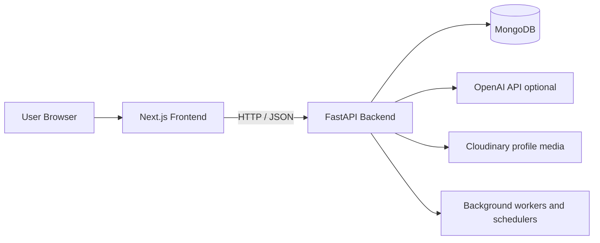

# KhoshGolpo

> **AI-augmented community and hiring platform** for threaded conversations, discovery, direct messaging, jobs, moderation, and personalized feeds.


---

## Overview

KhoshGolpo is a production-minded full-stack platform built to showcase a modern social product architecture. It combines a FastAPI backend, a Next.js frontend, MongoDB persistence, AI-assisted ranking and moderation features, and a rich set of community workflows that make it suitable for hiring demonstrations, portfolio reviews, and real product iterations.

The platform is organized around:

- **Community discussions** — threads, replies, posts, reactions, shares, and reports
- **People discovery** — profiles, follows, connection requests, search, and explore flows
- **Direct communication** — messages, conversations, read-state tracking, and blocks
- **Personalized feeds** — home, following, explore, my feed, topic selection, and ranking explainability
- **Jobs and recruitment** — job posting, applications, saved jobs, and pipeline management
- **Moderation and admin tools** — audit logs, appeals, bulk moderation, content review, and bot governance

---

## What’s implemented

### Community and content

- Thread creation, browsing, editing, deletion, and detail views
- Posts and replies with nested conversation handling
- Likes, shares, reports, and read-state tracking
- Topic tagging and content discovery controls
- Content visibility controls and soft-delete support

### Profiles and social graph

- Profile pages with slug-based public URLs
- Profile management for bio, experience, education, projects, skills, certifications, and contact links
- Avatar and banner media handling through Cloudinary
- Follow/unfollow support and follower/following views
- Connection requests with accept, reject, and cancel flows
- User search, people explore, and request management

### Messaging and notifications

- One-to-one conversation creation and message history
- Unread counts and read-state handling
- User blocking and unblock flows
- Notification list, read/unread states, and appeal workflow
- Moderation and notification-driven feedback loops

### Feed and discovery

- Home feed and following feed
- Explore feed with filters such as topics-only, exclude-own, and following priority
- My feed for topic-based personalization
- Feed preference management for interests, hidden tags, muted users, and inclusion rules
- Popular topics extraction
- Explainability endpoint that shows why a thread appears in a feed
- Admin feed controls for ranking weights, AI policy, debug inspection, and feed overrides

### Jobs and recruitment

- Job listing creation and management
- Job detail pages and saved jobs
- Application flow with stage tracking and application history
- My applications view
- Job reports for suspicious or inappropriate listings
- Pipeline-style workspace for reviewing candidates

### Administration and moderation

- User administration with search, detail views, status changes, and role management
- Content moderation for threads, posts, and related objects
- Bulk moderation actions
- Appeals handling and review workflows
- Audit logging with severity, result tracking, and searchable history
- Content removal and hard-delete flows with cascade behavior
- Bot governance, including create/enable/update/trigger/delete operations

### Authentication and security

- Register, login, refresh, logout, and current-user endpoints
- JWT-based auth with optional static auth mode for local/testing scenarios
- Login lockout after repeated failures
- Password change flow
- Identity-verification-based password recovery using recovery code / security answers
- Rate limiting for sensitive auth routes

---

## AI features

KhoshGolpo includes several AI-enabled behaviors that are designed to degrade gracefully when no OpenAI key is configured:

- **Tone check API** — pre-submit content scoring for posts and other text payloads
- **AI-assisted moderation scoring** — content analysis used in moderation workflows
- **AI-enhanced feed ranking** — feed scoring with configurable weighting and optional AI adjustments
- **Feed explanations** — transparent reason breakdowns for ranked feed items
- **Feed AI health and policy controls** — admin tooling to inspect AI usage, budget, timeout, and fallback metrics
- **Interest suggestion jobs** — batch generation of user interest tags to improve personalization

AI behavior is configured server-side and can be tuned through environment variables and admin feed policy controls.

---

## Tech stack

### Backend

- FastAPI
- Beanie ODM
- Motor / MongoDB
- Pydantic Settings
- PyJWT
- SlowAPI rate limiting
- Loguru logging
- APScheduler
- Celery task modules

### Frontend

- Next.js 16
- React 19
- TypeScript
- Tailwind CSS 4
- shadcn/ui + Radix UI
- SWR
- Zustand
- Ky
- next-themes
- React Markdown with sanitization support

### Platform and services

- Docker and Docker Compose
- Render deployment configuration
- Cloudinary for profile media assets
- OpenAI for optional AI features

---

## Architecture



The backend is async-first and keeps the app usable even if the database is temporarily unavailable, so API docs and the public surface remain accessible during local setup and troubleshooting.

---

## Repository layout

- `backend/` — FastAPI application, routers, services, models, workers, and tests
- `frontend/` — Next.js application with app routes, components, hooks, and UI primitives
- `shared/` — shared TypeScript constants and types
- `guide/` — internal guides and design experiments
- `design-system/` — project visual references and UI direction
- `docs/` — process notes, setup docs, and planning material
- `docker-compose.yml` — local API + Mongo orchestration
- `render.yaml` — Render deployment configuration

---

## Local development

### Prerequisites

- Python 3.12+
- Node.js LTS
- npm
- Docker Desktop, if you want the easiest MongoDB setup

### Backend

From the repository root:

```powershell
python -m venv .venv
./.venv/Scripts/python -m pip install --upgrade pip
./.venv/Scripts/python -m pip install -r backend/requirements.txt
Copy-Item backend/.env.example backend/.env
```

Start the backend:

```powershell
./.venv/Scripts/python -m fastapi dev backend/app/main.py
```

Backend endpoints:

- API: `http://127.0.0.1:8000`
- Health: `http://127.0.0.1:8000/health`
- API docs: `http://127.0.0.1:8000/docs`

### Frontend

```powershell
cd frontend
cmd /c npm install
$env:NEXT_PUBLIC_API_URL="http://127.0.0.1:8000"
cmd /c npm run dev
```

Frontend:

- `http://127.0.0.1:3000`

### Docker

```powershell
docker compose up --build
```

This starts the API and MongoDB locally. The frontend runs separately from `frontend/`.

---

## Configuration

Start with `backend/.env.example` and adjust values for your environment.

### Backend environment

| Variable | Purpose |
|---|---|
| `MONGODB_URI` | MongoDB connection string |
| `MONGODB_DB_NAME` | Database name |
| `CORS_ORIGINS` | Allowed frontend origins |
| `AUTH_MODE` | `jwt` or `static` |
| `JWT_SECRET_KEY` | Signing secret for JWT mode |
| `OPENAI_API_KEY` | Enables optional AI features |
| `AI_MODEL` | AI model name |
| `AI_WARNING_THRESHOLD` | Threshold for warning state |
| `AI_FLAG_THRESHOLD` | Threshold for flagged state |
| `CLOUDINARY_CLOUD_NAME` | Cloudinary cloud name |
| `CLOUDINARY_API_KEY` | Cloudinary API key |
| `CLOUDINARY_API_SECRET` | Cloudinary API secret |

### Frontend environment

| Variable | Purpose |
|---|---|
| `NEXT_PUBLIC_API_URL` | Backend base URL used by the UI |

---

## Recent updates (May 2026)

### Real-time sync for thread engagement metrics

Thread updates (likes, post counts) now sync in real-time across both detail panel and list view:

- **Backend**: Feed API (`/feed/home`, `/feed/following`, `/feed/explore`) now returns accurate `like_count` and `liked_by_me` for each thread
- **Frontend**: Detail panel updates trigger a callback that refreshes the thread in the list cache, eliminating stale counts
- **UX**: Like a thread in the detail panel → count updates immediately in both views without page refresh

### Thread card markdown rendering

Thread card bodies now properly render markdown formatting (bold, italic, code blocks, links) instead of displaying raw syntax.

### Bug fixes

- Fixed feed API overwriting like_count with hardcoded 0 values
- Restored like_count and liked_by_me fields from feed API responses
- Thread detail hook now calls parent callback on all state updates (like, edit, reply)

---

## Testing

Backend tests live in `backend/tests/` and can be run from `backend/` with pytest. The frontend also exposes a lint script through Next.js.

Common quality checks:

- Backend test suite
- Frontend linting
- Manual smoke test of auth, threads, messaging, feed, jobs, and admin pages

---

## Deployment

### Backend on Render

The repository includes `render.yaml` and a backend Dockerfile. Configure your MongoDB URI, auth secret, CORS allowlist, and optional AI / Cloudinary settings in the Render dashboard.

### Frontend on Vercel

Deploy the `frontend/` directory and point `NEXT_PUBLIC_API_URL` at the backend domain.

---

## API surface

The backend includes routers for:

- `auth`
- `users`
- `profiles`
- `threads`
- `posts`
- `messages`
- `notifications`
- `connections`
- `channels`
- `feed`
- `ai`
- `jobs`
- `bot`
- `admin`
- `admin_feed`
- `admin_profiles`
- `health`

That gives the project a broad product surface while keeping the implementation modular and easy to extend.

---

## Why this project is hiring-ready

KhoshGolpo is not just a demo CRUD app. It shows:

- a real product shape with social, feed, messaging, and jobs workflows
- thoughtful backend architecture with async APIs and modular routers
- optional AI features that are controllable instead of bolted on
- admin and moderation flows that reflect production realities
- a polished frontend with multiple workspaces and clear product areas
- deployment and local-dev paths that are practical for real teams

It’s the kind of repo that helps a reviewer understand both product thinking and engineering depth.

---

## License

Add your project license here before publishing publicly.
